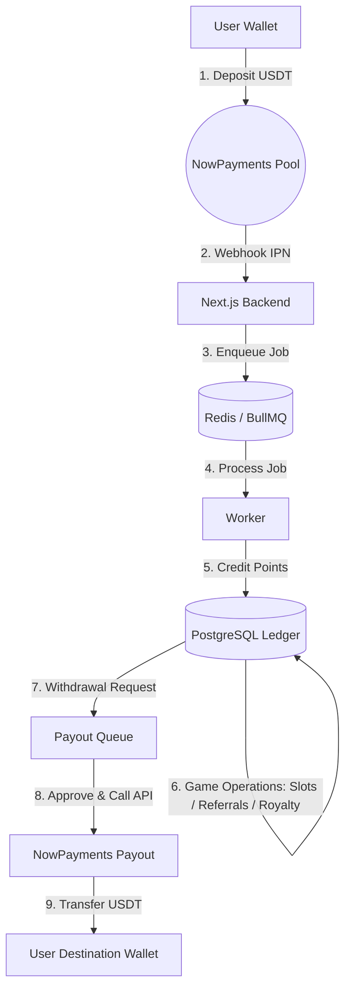
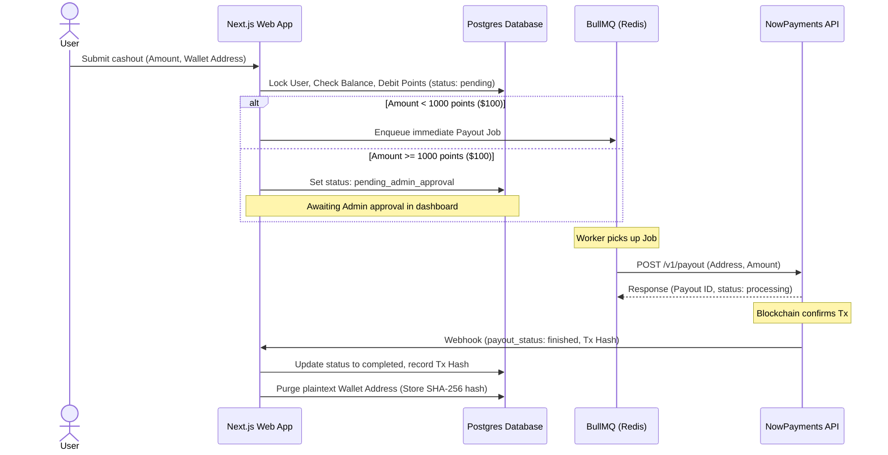

# Apex — Complete Points Flow Reference

Every moment a user's balance can change, why it changes, the amount, the
transaction type written to the ledger, and the exact source location.

All balance writes go through a single function:

```
src/lib/distribution.ts → post(tx, userId, type, points, opts)
```

`post()` locks the user row, computes `balanceAfter`, updates
`users.pointsBalance`, and appends one row to `transactions`. There is no other
code path that modifies a balance (except the admin hard-reset described at the
end of this file).

---

## 1 · Registration

**Triggered by:** `registerAction` in `src/app/actions/auth.ts`  
**Engine function:** `chargeRegistration(tx, userId)` — `src/lib/distribution.ts:382`  
**Timing:** Synchronously inside the registration DB transaction, before the user
ever sees the dashboard.

The 50-point join cost is split into three parts:

| Sub-event | Affects | Direction | Amount | Tx type | Line |
|---|---|---|---|---|---|
| ID & PIN fee | new member | **debit** | `settings.idPinFee` (default **10**) | `id_pin_fee` | [dist:391](src/lib/distribution.ts) |
| Sponsor reward carved from ID-PIN | direct sponsor | **credit** | `settings.sponsorReward` (default **5**) | `referral_bonus` | [dist:396](src/lib/distribution.ts) |
| Royalty program contribution | new member | **debit** | `settings.royaltyFee` (default **10**) | `royalty_fee` | [dist:402](src/lib/distribution.ts) |

> If there is **no sponsor** (direct sign-up), the sponsor reward is simply not
> paid — the full `idPinFee` stays with the system and no `referral_bonus` tx
> is written.
>
> The `royaltyFee` debit is immediately added to `pools.royaltyPool` in the
> same DB transaction ([dist:406](src/lib/distribution.ts)).

**Net balance change at registration (before activation):**

```
new member :  −(idPinFee + royaltyFee)  →  −20 pts  (defaults)
sponsor    :  +(sponsorReward)           →  +5  pts  (if referred)
```

---

## 2 · Activation (enter Slab 1)

**Triggered by:** BullMQ `activate` job enqueued at the end of
`registerAction` → `src/lib/queue.ts → enqueueActivation(userId)`  
**Engine function:** `activate(userId)` → `enterSlab(tx, userId, 1)` —
`src/lib/distribution.ts:366 / 131`  
**Timing:** Seconds after registration, processed by the worker process.

| Sub-event | Affects | Direction | Amount | Tx type | Line |
|---|---|---|---|---|---|
| Autopool entry fee | new member | **debit** | `slabs[1].fee` (default **30**) | `activation_fee` | [dist:170](src/lib/distribution.ts) |
| Slot credit to upline owner | the person whose oldest open slot is claimed | **credit** | `slabs[1].fee − houseCut` | `slot_credit` | [dist:190](src/lib/distribution.ts) |
| House cut from upline | the upline owner | **debit** | `floor(fee × companyPercent / 100)` (default **0**) | `company_fee` | [dist:196](src/lib/distribution.ts) |

> **FIFO rule:** The oldest open slot across all players at this level is
> claimed first (`ORDER BY queue_seq … FOR UPDATE SKIP LOCKED`). If no open
> slot exists yet (first player ever at this level), no `slot_credit` is
> written — nobody to pay.
>
> `companyPercent` defaults to 0 so the house cut is normally absent.
>
> At the end of `enterSlab`, the member's **own** `slab.slots` empty slots are
> opened in the `slots` table — these are what future entrants will fill.

**Net balance change at activation (defaults, with sponsor):**

```
new member  :  −30 pts  (activation_fee)
upline owner:  +30 pts  (slot_credit; if companyPercent = 0)
```

---

## 3 · Every slot that fills under you (ongoing)

**Triggered by:** Any other player registering and being activated.  
**Engine function:** `enterSlab` — `src/lib/distribution.ts:131`  
**Timing:** Each time a new player's worker job runs and their FIFO placement
lands in one of your open slots.

| Sub-event | Affects | Direction | Amount | Tx type | Line |
|---|---|---|---|---|---|
| Slot owner receives fee | you (slot owner) | **credit** | `slab.fee − houseCut` | `slot_credit` | [dist:190](src/lib/distribution.ts) |
| House cut deducted | you (slot owner) | **debit** | `floor(fee × companyPercent / 100)` | `company_fee` | [dist:196](src/lib/distribution.ts) |

> This repeats once per slot filled. For Slab 1 (2 slots) you receive 2
> credits. For Slab 5 (32 slots) you receive up to 32 credits.
>
> When your **last open slot** at a level is filled, `markSlabComplete` runs
> ([dist:262](src/lib/distribution.ts)) — it records the `collected` total and
> sets `users.pendingChoiceSlab`, gating the Exit / Upgrade decision.

---

## 4 · Slab referral bonus (per-slab, if configured)

**Triggered by:** Inside `enterSlab`, after the slot is assigned.  
**Engine function:** `enterSlab` — `src/lib/distribution.ts:219`

| Sub-event | Affects | Direction | Amount | Tx type | Line |
|---|---|---|---|---|---|
| Per-slab referral bonus | direct sponsor of the entering player | **credit** | `slabs[level].referralBonus` | `referral_bonus` | [dist:223](src/lib/distribution.ts) |

> Default `referralBonus` is **0** for all slabs (the registration-time sponsor
> reward via `chargeRegistration` is the primary referral incentive). This
> column lets admins add an extra per-slab bonus from the Admin → Slabs page
> without changing code.

---

## 5 · Exit decision

**Triggered by:** User clicks "Cash out & exit" on the dashboard, or admin
triggers via `decideAction`.  
**Engine function:** `decideChoice(userId, "exit")` —
`src/lib/distribution.ts:291`  
**Precondition:** `users.pendingChoiceSlab` must be set (all slots filled).

| Sub-event | Affects | Direction | Amount | Tx type | Line |
|---|---|---|---|---|---|
| Forfeit to house | you | **debit** | `floor(collected × (100 − exitPercent) / 100)` | `company_fee` | [dist:316](src/lib/distribution.ts) |
| Exit payout marker | you | **0 pts marker** | records `payout` and `keepPct` in `meta` | `exit_payout` | [dist:322](src/lib/distribution.ts) |

**Exit percentages by slab (defaults):**

| Slab | Name | Keep | Forfeit |
|---|---|---|---|
| 1 | Starter | **100 %** | 0 % |
| 2 | Builder | 30 % | **70 %** |
| 3 | Achiever | 30 % | **70 %** |
| 4 | Leader | 30 % | **70 %** |
| 5 (final) | Champion | **100 %** | 0 % |

> The forfeit amount is deducted from the balance; `collected` itself was
> already credited in step 3. The `exit_payout` tx records **0 points** because
> no additional money moves — it is purely an audit marker with the math in
> `meta.payout`.
>
> After exit, `users.status` becomes `"exited"` (or `"completed"` for the
> final slab) and the user can no longer take any game actions.

---

## 6 · Upgrade decision

**Triggered by:** User clicks "Upgrade to next stage" on the dashboard.  
**Engine function:** `decideChoice(userId, "upgrade")` —
`src/lib/distribution.ts:291`  
**Precondition:** `users.pendingChoiceSlab` must be set AND a next active slab
must exist.

| Sub-event | Affects | Direction | Amount | Tx type | Line |
|---|---|---|---|---|---|
| Upgrade marker | you | **0 pts marker** | records `kept`, `seed`, `collected` in `meta` | `upgrade_take` | [dist:347](src/lib/distribution.ts) |
| Next slab entry fee | you | **debit** | `nextSlab.fee` | `upgrade_fee` | [dist:170](src/lib/distribution.ts) |
| Slot credit / house cut at new level | you + upline | same as step 3 | same as step 3 | `slot_credit` / `company_fee` | [dist:190](src/lib/distribution.ts) |

> The net kept by the player is `max(0, collected − nextSlab.fee)`.  
> Example at defaults (Slab 1 → 2): collected 60 pts (2 × 30), next fee 60 pts
> → kept = 0. The `upgrade_take` tx records this in `meta` for auditability.
>
> Upgrading re-runs the full `enterSlab` flow at the new level, so all step-3
> events (upline credit, FIFO slot creation) apply again at the higher tier.

---

## 7 · Royalty payout — rank reward

**Triggered by:** BullMQ repeatable cron (`5 0 10,20,28 * *` — 3× a month) or
admin "Run distribution" button.  
**Engine function:** `distributeRoyalty()` — `src/lib/royalty.ts:31`

| Sub-event | Affects | Direction | Amount | Tx type | Line |
|---|---|---|---|---|---|
| Rank reward | every user in a qualifying royalty band | **credit** | `floor( (pool × band.percent / 100) / bandMemberCount )` | `royalty_payout` | [royalty:82](src/lib/royalty.ts) |

**Royalty rank bands (defaults):**

| Band | Min direct referrals | Pool share |
|---|---|---|
| Bronze | 10+ | 10 % |
| Silver | 25+ | 12 % |
| Gold | 50+ | 18 % |
| Platinum | 100+ | 25 % |
| Diamond | 200+ | 30 % |

> Each run first carves 5 % of the pool into the reserve fund before
> distributing ([royalty:39](src/lib/royalty.ts)).  
> Each user is assigned to their **highest** qualifying band only.  
> The sub-pool for that band is split equally among all members in it.  
> Undistributed fractions (rounding) carry over to `pools.royaltyPool`.

---

## 8 · Royalty payout — reserve reward

**Triggered by:** Same cron / admin button as step 7, runs in the same
transaction.  
**Engine function:** `distributeRoyalty()` — `src/lib/royalty.ts:96`

| Sub-event | Affects | Direction | Amount | Tx type | Line |
|---|---|---|---|---|---|
| Reserve reward | eligible inactive users (see below) | **credit** | `floor( reserveBalance / eligibleCount )` | `royalty_reserve_reward` | [royalty:118](src/lib/royalty.ts) |

**Eligibility conditions (all must be true):**

1. `role = 'user'`
2. `status` not `exited` or `completed`
3. Account is at least `reserveInactivityMonths` (default 6) old
4. Has not cleared a stage in the last `reserveInactivityMonths`
5. Has not received a reserve reward in the last `reserveInactivityMonths`

> The reserve accumulates from the 5 % carve-out of every royalty run. If no
> eligible users exist this run, the reserve simply carries over.

---

## 9 · Admin: Manual adjustment (reserved type)

**Tx type:** `adjustment` — `src/db/schema.ts:39`  
**Current status:** The enum value exists and is shown in the transactions UI
(`src/app/dashboard/transactions/page.tsx:17`) but **no admin action currently
writes it**. It is a placeholder for a future "manual credit / debit" admin
tool.

---

## 10 · Admin: System reset (hard wipe)

**Triggered by:** Admin clicks "Reset system" → `resetSystemAction()` —
`src/app/actions/admin.ts:110`  
**This does NOT go through `post()`** — it writes directly to the DB.

| What happens | Code |
|---|---|
| All `transactions` rows deleted (TRUNCATE) | [admin:112](src/app/actions/admin.ts) |
| All `slots`, `slabCompletions`, `royaltyRuns`, `royaltyPayouts` deleted | [admin:112](src/app/actions/admin.ts) |
| All non-admin users deleted | [admin:113](src/app/actions/admin.ts) |
| Admin users: `pointsBalance → 0`, slab state cleared | [admin:116](src/app/actions/admin.ts) |
| `pools.royaltyPool` and `pools.royaltyReserve → 0` | [admin:118](src/app/actions/admin.ts) |

> No transaction record is written. The ledger is wiped, so there is no audit
> trail after a reset. This is intentional for demo / restart purposes.

---

## Master summary table

```
Event                         Who gains pts       Who loses pts       Tx type(s)
──────────────────────────────────────────────────────────────────────────────────
Registration                  sponsor (+5)        new member (−20)    id_pin_fee
                                                                       royalty_fee
                                                                       referral_bonus
──────────────────────────────────────────────────────────────────────────────────
Activation / Enter Slab 1     upline (+30)        new member (−30)    activation_fee
                              (minus house cut)                        slot_credit
                                                                       company_fee
──────────────────────────────────────────────────────────────────────────────────
Slot filled (any slab)        you (+slab.fee)     you (−houseCut)     slot_credit
                                                                       company_fee
──────────────────────────────────────────────────────────────────────────────────
Per-slab referral bonus       your sponsor (+n)   nobody              referral_bonus
(if referralBonus > 0)
──────────────────────────────────────────────────────────────────────────────────
Exit — Slab 1 or Final        you (keep 100%)     nobody              company_fee (0)
                                                                       exit_payout (marker)
──────────────────────────────────────────────────────────────────────────────────
Exit — Slabs 2–4              you (keep 30%)      you (−70% forfeit)  company_fee
                                                                       exit_payout (marker)
──────────────────────────────────────────────────────────────────────────────────
Upgrade                       you (keep surplus)  you (−nextFee)      upgrade_take (marker)
                              upline (+nextFee)                        upgrade_fee
                                                                       slot_credit
──────────────────────────────────────────────────────────────────────────────────
Royalty rank reward           ranked users (+n)   nobody (from pool)  royalty_payout
──────────────────────────────────────────────────────────────────────────────────
Royalty reserve reward        inactive users (+n) nobody (from pool)  royalty_reserve_reward
──────────────────────────────────────────────────────────────────────────────────
Admin reset                   nobody              everyone (→ 0)      no tx written
──────────────────────────────────────────────────────────────────────────────────
```

---

## The single write path

```
Every credit / debit
        │
        ▼
  post(tx, userId, type, points, opts)       src/lib/distribution.ts:39
        │
        ├─ SELECT … FOR UPDATE  (lock user row)
        ├─ balanceAfter = current + points
        ├─ UPDATE users SET pointsBalance = balanceAfter
        └─ INSERT INTO transactions (userId, type, points, balanceAfter, …)
```

Any future balance-changing feature **must** go through `post()` to keep the
ledger and the cached balance in sync.

---

## All 13 transaction types (enum `tx_type`)

| Type | Direction | Description |
|---|---|---|
| `join_fee` | debit | Legacy; no longer written (replaced by the split below) |
| `id_pin_fee` | debit | Registration: ID & PIN fee portion |
| `royalty_fee` | debit | Registration: royalty pool contribution |
| `activation_fee` | debit | Entering Slab 1 for the first time |
| `upgrade_fee` | debit | Entering Slab 2–5 via upgrade |
| `slot_credit` | credit | A slot you own was filled |
| `referral_bonus` | credit | Someone you referred registered or entered a slab |
| `exit_payout` | 0 marker | Audit record when you exit (actual kept pts already in balance) |
| `upgrade_take` | 0 marker | Audit record when you upgrade (records kept/seed/collected) |
| `company_fee` | debit | House cut on slot credit, or forfeit on mid-tier exit |
| `royalty_payout` | credit | Monthly rank-band royalty reward |
| `royalty_reserve_reward` | credit | Monthly reserve fund reward for inactive players |
| `adjustment` | either | Reserved for future manual admin credit/debit |
| `usdt_deposit` | credit | Purchasing virtual points using NowPayments USDT |
| `usdt_withdrawal` | debit | Requesting a withdrawal converting virtual points to USDT |

---

## 11 · NowPayments USDT Crypto Payment Integration

To support seamless on-boarding and cashouts, a USDT payment gateway is integrated using **NowPayments** as the transaction processor. Below is the system design detailing the mechanics of transaction anonymity, queue scalability, and profit-gradient safety.

### 11.1 · System Architecture Overview

On-chain crypto transactions are used strictly as entry and exit portals, while in-game mechanics run on an off-chain fast database ledger:



### 11.2 · Cryptographic Anonymity & Traceability Minimisation

To ensure player anonymity and avoid linkability between depositing wallets and withdrawing wallets:

1. **Merchant-Side Pooling (The Mixer Effect):**
   When a user deposits USDT, NowPayments generates a dynamic, one-time deposit address. The user's funds are swept into the master merchant wallet pool. When a user cashouts, the withdrawal is broadcast from NowPayments' general payout pool. There is **no direct blockchain connection** (wallet-to-wallet link) between the depositor's wallet address and the withdrawer's wallet address.
   
2. **Off-Chain Point Redistribution (Built-in Mixing):**
   Deposited funds are converted to virtual points. Points then circulate through the multi-level matrix:
   - 20 points split to ID-PIN and Royalty pools upon registration.
   - 30 points credited to uplines (slot_credit) or sponsors (referral_bonus) upon activation.
   - Continuous slab upgrades redistribute points across multiple users.
   When a user cashes out, their points balance is a composite of credits from dozens of other downline addresses. The matrix itself acts as an off-chain privacy mixer.
   
3. **Data Erasure & Wallet Address Encryption:**
   - Destination wallet addresses entered for withdrawals are encrypted using application-level **AES-256-GCM** before being written to the database.
   - Once a withdrawal completes successfully and is confirmed on-chain, the destination wallet address is **deleted/wiped** from the active database row. It is replaced with a one-way **SHA-256 hash** combined with a salt, which prevents traceability while allowing the system to verify and prevent duplicate withdrawal spam to the same address.

---

### 11.3 · Deposit Webhook/IPN Pipeline

1. **Invoice Creation:** The user triggers a server action requesting a point deposit (e.g., buying 100 points). Next.js calls NowPayments `POST /v1/payment` specifying `price_amount = 10.00`, `price_currency = "usd"`, `pay_currency = "usdtbsc"` (BSC BEP-20 network is recommended to minimise gas), and a unique `order_id` linking to the user.
2. **Dynamic Address Display:** The API returns a dynamic deposit address and payment ID. The frontend displays this to the user with a payment expiration countdown timer (e.g., 20 minutes).
3. **IPN Webhook Reception:** When the blockchain transaction receives confirmation, NowPayments hits the `/api/webhooks/nowpayments` endpoint.
4. **Signature Verification:** The endpoint verifies the payload authenticity:
   ```typescript
   import { createHmac } from "crypto";
   const signature = req.headers["x-nowpayments-sig"];
   const hmac = createHmac("sha512", process.env.NOWPAYMENTS_IPN_SECRET);
   hmac.update(JSON.stringify(req.body, Object.keys(req.body).sort()));
   const verified = signature === hmac.digest("hex");
   ```
5. **Durable Queuing:** If verified and `payment_status === "finished"`, a credit job is enqueued to BullMQ:
   ```typescript
   await paymentQueue.add("credit_deposit", {
     userId: dbOrderId.userId,
     paymentId: body.payment_id,
     amountPoints: Math.floor(body.actually_paid * pointsPegRatio),
     idempotencyKey: `dep:${body.payment_id}`
   });
   ```
6. **Worker Processing:** The BullMQ worker picks up the job, executes a PostgreSQL transaction that locks the user row, runs `post()`, logs the `usdt_deposit` transaction, and sets the transaction status to `completed`.

---

### 11.4 · Payout / Withdrawal Pipeline

To prevent double-spending, balance discrepancy, and API rate-limiting issues, withdrawals run through a structured Queue and Admin-gated approval pipeline:



1. **Point Lock-step debit:** When a user requests a withdrawal of `P` points:
   - A DB transaction locks the user row.
   - Points are debited immediately: `post(tx, userId, "usdt_withdrawal", -P)`.
   - A pending row is written to `crypto_transactions` containing the encrypted payout address.
2. **Threshold Checks:**
   - **Auto-payout (< 1000 points):** Automatically enqueued to the payout queue.
   - **Manual Admin Audit (>= 1000 points):** Flagged as `pending_admin_approval`. The admin must review the user's transaction history to verify that the points were organically earned (not from a matrix loophole or bug) before releasing the job to the queue.
3. **Execution Worker:** A worker running at concurrency 1 processes payout jobs, sending a payout API request to NowPayments.
4. **Error Compensating Transactions:** If the NowPayments API calls return an error or if the transaction is cancelled, the worker triggers a compensating credit transaction to refund the points to the user's balance:
   `post(tx, userId, "adjustment", P, { note: "Refund: Payout failed" })`

---

### 11.5 · Database Schema Extension

Drizzle schemas for tracking crypto integrations:

```typescript
export const cryptoTxStatus = pgEnum("crypto_tx_status", [
  "pending",
  "pending_admin_approval",
  "processing",
  "completed",
  "failed",
  "expired",
]);

export const cryptoTxType = pgEnum("crypto_tx_type", ["deposit", "withdrawal"]);

export const cryptoTransactions = pgTable("crypto_transactions", {
  id: uuid("id").primaryKey().defaultRandom(),
  userId: uuid("user_id").notNull(),
  type: cryptoTxType("type").notNull(),
  status: cryptoTxStatus("status").notNull().default("pending"),
  
  // Financial amounts
  amountUsdt: numeric("amount_usdt", { precision: 18, scale: 6 }).notNull(),
  amountPoints: integer("amount_points").notNull(),
  feeUsdt: numeric("fee_usdt", { precision: 18, scale: 6 }).notNull().default("0.000000"),
  
  // Network parameters
  network: text("network").notNull(), // 'trc20', 'bep20', 'erc20'
  paymentId: text("payment_id"), // NowPayments payment/payout ID
  txHash: text("tx_hash"), // Blockchain transaction ID
  
  // Privacy protections
  encryptedWalletAddress: text("encrypted_wallet_address"), // AES-256 encrypted, wiped on completion
  hashedWalletAddress: text("hashed_wallet_address"), // SHA-256 hash for dispute validation
  
  createdAt: timestamp("created_at", { withTimezone: true }).notNull().defaultNow(),
  updatedAt: timestamp("updated_at", { withTimezone: true }).notNull().defaultNow(),
}, (t) => ({
  userIdx: index("crypto_tx_user_idx").on(t.userId),
  paymentIdx: uniqueIndex("crypto_tx_payment_idx").on(t.paymentId),
}));
```

---

### 11.6 · Mathematical Profit Gradient & Surcharges

To guarantee the game remains mathematically profitable and immune to exchange rate risk or gas draining:

1. **The Exchange Rate Buffer:**
   To account for USDT price fluctuations and NowPayments markup, a 2% buffer is applied during point conversion.
   - **Deposit Conversion:** `1 USDT = 10 Points` (base rate). A 2% buffer is subtracted when buying points: e.g., deposit 10 USDT -> credits 98 Points.
   - **Withdrawal Conversion:** `10 Points = 1 USDT` (base rate). A 2% buffer is added when selling points: e.g., cashout 100 Points -> deducts 100 Points, pays out 9.80 USDT.

2. **Network Gas Fee Surcharge:**
   NowPayments charges network fees which vary by chain. To avoid depletion of reserve funds:
   - **BEP-20:** Flat fee of **2.00 USDT** per withdrawal.
   - **ERC-20:** Flat fee of **15.00 USDT** per withdrawal (due to Ethereum network congestion).
   - **Minimum Withdrawal:** Locked to a minimum of **20.00 USDT** to prevent network fee overhead from devouring micro-withdrawals.

3. **System Reserve Safety Ratio:**
   Because of the built-in mid-tier exit forfeits (Slabs 2, 3, and 4 forfeit 70% of points back to the system reserve pool), the points balance is structurally deflated.
   
   $$\text{Points Deposited} \ge \text{Outstanding Points} + \text{System Profit}$$
   
   Since the points are backed 1:1 by real USDT deposits, the total USDT held in the merchant wallet is guaranteed to exceed the total outstanding points liability, maintaining a reserve safety ratio of $> 1.0$. This profit gradient protects the system from bank runs and guarantees permanent solvency.

